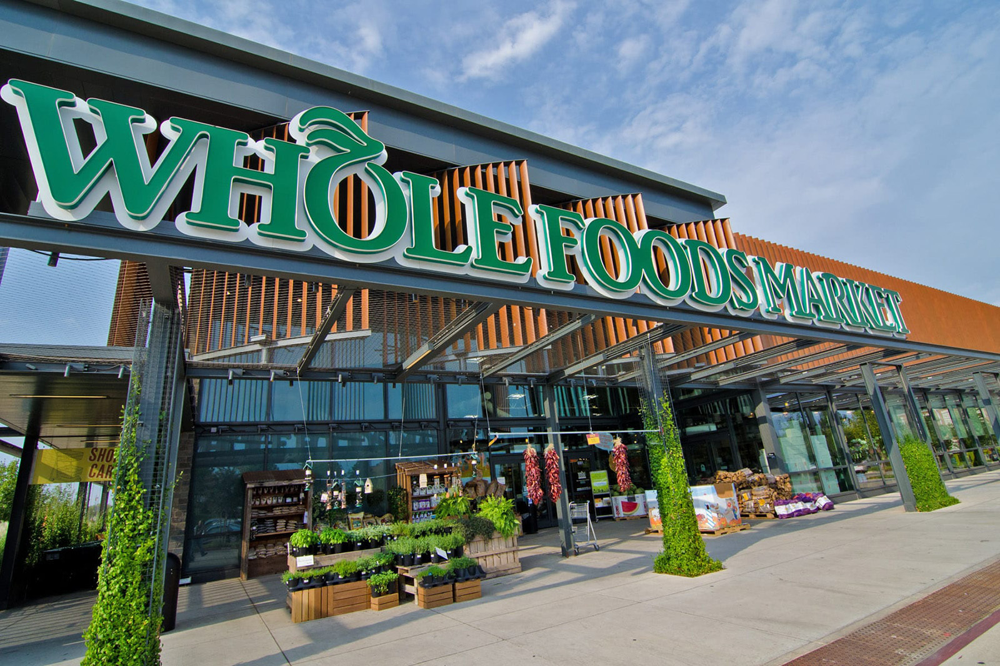

# Good Produce Image Classification
#### By John Harrigan

## Overview
By looking at over 30,000 images of healthy and rotten fruit, I am attempting to make a Neural Network model that can correctly classify if a fruit is rotten or not based only on its image. This is a simple binary classification that will look at one of nine different kinds of fruit to see if they are rotten under the understanding that all fruit decay in a very similar manner.

## Business Problem

Whole foods is a company that has succeeded because of their brand. They have built a brand of being a company that provides quality produce at reasonable prices. Every company knows that protecting your brand is important because many customers only give you their business because they trust that brand. Whole Foods hired me to help protect one of the most important items on their shelves, produce. Many people go to Whole Foods just so they can get quality produce that they can trust. So, naturally, Whole Foods wants to keep the quality as high as possible. My job was to make an image classification system that could look at all of the fruits that Whole Foods received and check to see if any of it was rotten.

## Data
The data for this project is a compiltion of two different datasets of images from Mendeley and Kaggle. Each dataset has images of multiple different kinds of fruit including: apples, oranges, bananas, grapes, strawberries, pomegranates, guava, lime, and jujubes. These images are divided up by type of fruit, and whether or not that fruit is rotten. I only used a sample of the entire dataset for this model because feeding in all 30,000 images would have taken a massive amount of time and processing power.

## Methods
I started by formatting the data for the first dataset provided by Mendeley so that it was randomly split up into three different folders: train, test, and validation. Next I added in the Kaggle dataset according to the same folder setup so that I was left with three folders that all had subfolders for the quality of the fruit.

for the first full model I just did a basic model with as little complexity as possible. I wanted to just get the Neural Network to run properly before I did anything to improve the performance of the model.

from the accuracy metric for the model I could see that my biggest problem was the overfitting on the trainning data. I knew that I was going to have to decrease the overfitting while also increasing the complexity of the model so that it could more effectively classify the images.

For the third model I attempted to see if multi classification would give more accurate results. I thought maybe if the network first identified what type of fruit it was looking at, then determined if that fruit was rotten, then it would be a more accurate model on the whole.

As you can see from the graph, because of all the different kinds of fruit that I had in my dataset it was very difficult for the model to correctly classify the type of fruit and whether or not it was rotten. Rather than spending more time trying to get the model to be more accurate, I decided to focus on a simpler binary classification with some hyperparameterization thrown in to make the model more accurate.

## Results

For the final model I used the Convolutional layers, Dropout layers, and dense layers to get the highest accuracy scores possible. This model is not perfect but with 88% accuracy it was as good as I was going to get without completely restructering the model.

## Conclusions
My final model can predict whether or not a given fruit is rotten 88% of the time with a loss of 0.55 on average.

## Next Steps
- **Get a bigger dataset** with more advanced alternatives for each original photo
- Find photos that cover **more of the range of states of decay** for each kind of rotting fruit
- **Expand the variety of fruits** in the dataset to that the model can be used on a wider range of produce
- **Add another established neural network** to my model with transfer learning to make my model more accurate 

